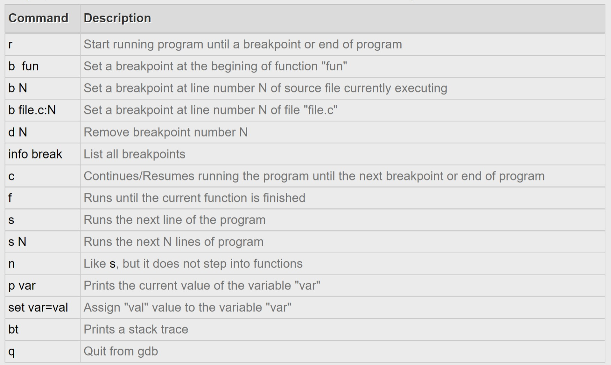

# GDB Tutorial

## How to Install GDB?

You can install gdb on Debian-based linux distro (e.g. Ubuntu, Mint, etc) by following command.

```bash
sudo apt-get update
sudo apt-get install gdb
```

## GDB Commands

Before you learn to how to use GDB, it would be good idea to get to know some GDB commands. GDB is command line utility. You will have to execute command on gdb shell. 

You can access list of all gdb commands with their description here: [Ch03_10_GDB_commands.md](./Ch03_10_GDB_commands.md) .

## How to use GDB?

GDB can be used in two ways:

1. To Debug running program having logical error, crashing or hanging.
2. To Debug coredump of pogram generated automatically when program crashes.

You will see first way to debug live/running program using GDB in this tutorial. Below steps will guide how to run program with GDB.

**Step 1:** Compile and Build program with debugging symbols:

```bash
g++ -g ./main.cpp
```

You can see -g flag is provided to compile program. This will generate  debug symbols of program. Which is necessary to debug any program with  GDB. 

**Step 2:** Run program with GDB:

```bash
gdb ./a.out
```

GDB read debug symbols from a.out and GDB prompt appeared where we can execute GDB commands.

**Step 3:** Set breakpoints:

```bash
(gdb) break main
```

The above is to set a breakpoint in the main function.

**Step 4:** Run program:

```bash
(gdb) run
```

If the breakpoint was set on main function, program will stop at main function and wait for gdb command.

**Step 5:** Use GDB commands to analyze and debug program:

Here are few commands which are commonly used. 



**Step 6:** Exit GDB:

```bash
(gdb) quit
```

Type "quit" on GDB prompt to exit GDB.


## References

- [Tutorial | GDB Tutorial](http://www.gdbtutorial.com/tutorial)
- [Debugging Options (Using the GNU Compiler Collection (GCC))](https://gcc.gnu.org/onlinedocs/gcc/Debugging-Options.html#Debugging-Options)
- [GDB Documentation (sourceware.org)](https://www.sourceware.org/gdb/documentation/)
- [GNU操作系统和自由软件运动](https://www.gnu.org/)
- [GDB调试 - 知乎 (zhihu.com)](https://zhuanlan.zhihu.com/p/272083977)
- [Home · google/sanitizers Wiki · GitHub](https://github.com/google/sanitizers/wiki)
- [The Valgrind Quick Start Guide](https://valgrind.org/docs/manual/quick-start.html)
- [AddressSanitizer (ASan) for the Linux Workload in Visual Studio 2019 - C++ Team Blog (microsoft.com)](https://devblogs.microsoft.com/cppblog/addresssanitizer-asan-for-the-linux-workload-in-visual-studio-2019/)

